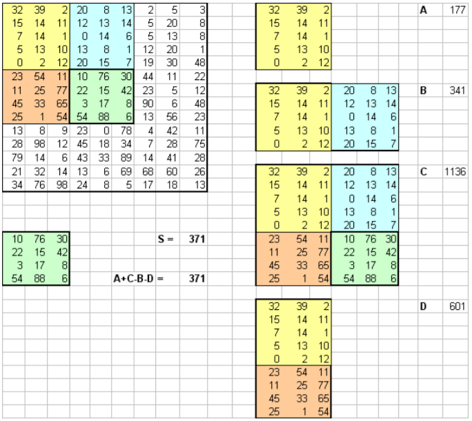

Интегральное представление изображения
=============================

Расчёт интегрального представления
------------

######def integral_view(image, x, y, integral_image):

    Args:
        image: Исходная матрица
        x: Координата пикселя по "х"
        y: Координата пикселя по "y"
        integral_image: Матрица в интегральном представлении   

    Returns:
        Пиксель в его интегральном представлении

    if (x-1) > -1 and (y-1) > -1:
        return image[x][y]-integral_image[x-1][y-1]+integral_image[x-1][y]+integral_image[x][y-1]
    else:
        return image[x][y]

######def integral_view_final(image):

    Args:
        image: Исходная матрица

    Returns:
        integral_image: Матрица в интегральном представлении   

    M = 3
    N = 5
    integral_image = []
    for k in range(N):
        integral_image.append([0]*M)
    for i in range(N):
        for j in range(M):
            integral_image[i][j] = integral_view(
                image, i, j, integral_image)
    return integral_image

Cумма пикселей произвольного прямоугольника,
ограниченного заданными пикселями
------------
#### Пример суммы пикселей в произвольном прямоугольнике

######def rect_sum(image, x1: int, y1: int, x2: int, y2: int):

    Args:
        image: Исходная матрица
        x1: Координата верхнего правого пикселя по "х"
        y1: Координата верхнего правого пикселя по "y"
        x2: Координата нижнего левого пикселя по "х"
        y2: Координата нижнего левого пикселя по "y"

    Returns:
        summ: Сумма пикселей ограниченных дополнительной матрицой,
              заданной двумя точками  

    summ = 0
    for i in range(int(y1)-1, int(y2)):
        for j in range(int(x1-1), int(x2)):
            summ += image[i][j]
    return summ

Дополнительные источники
-----------

Подробная информация про - [интегральное представление матрицы](https://habr.com/ru/post/133826/).